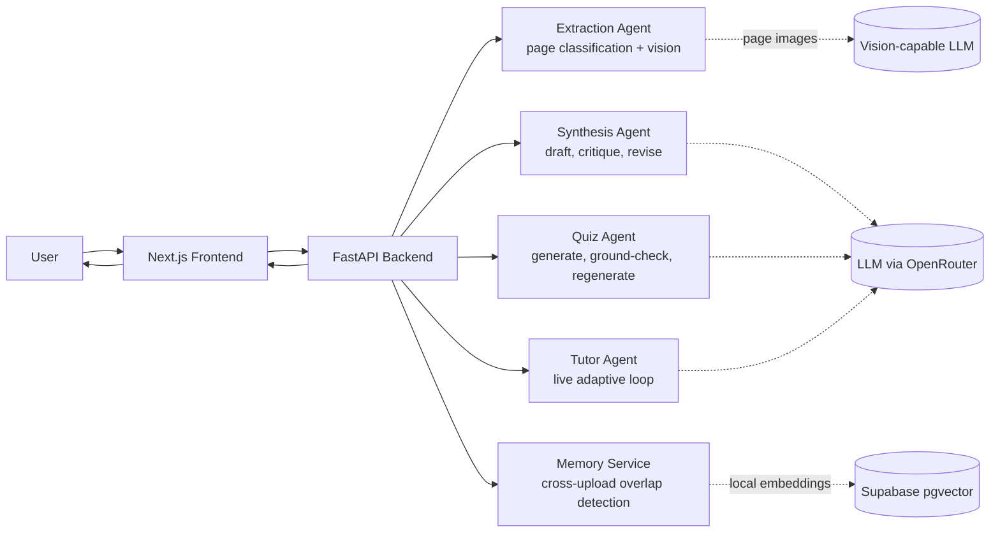
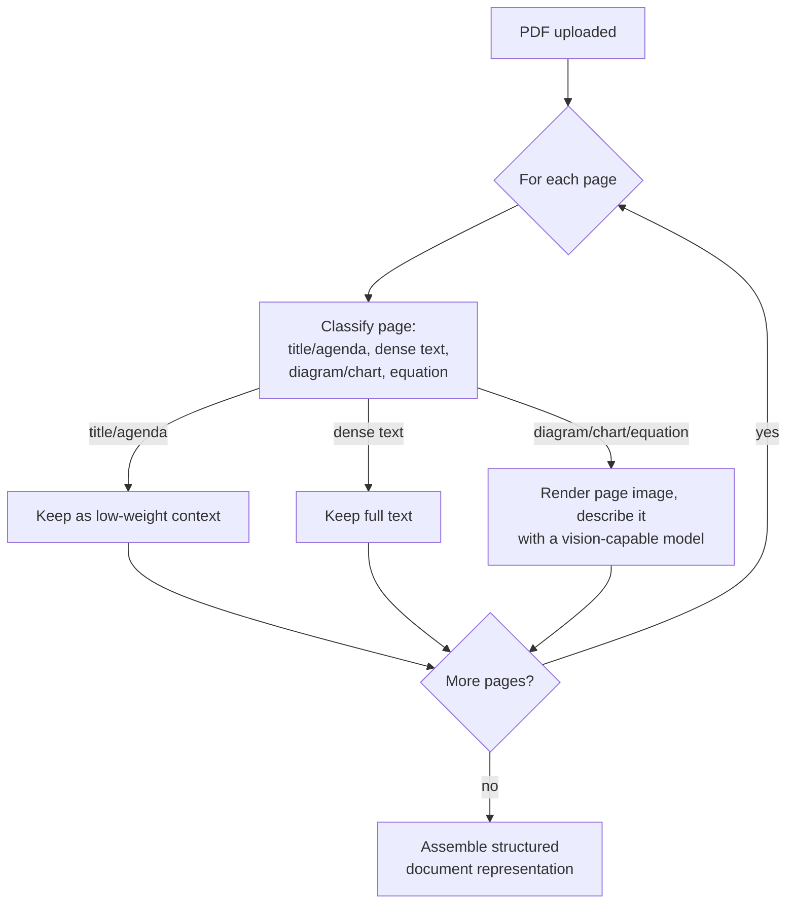
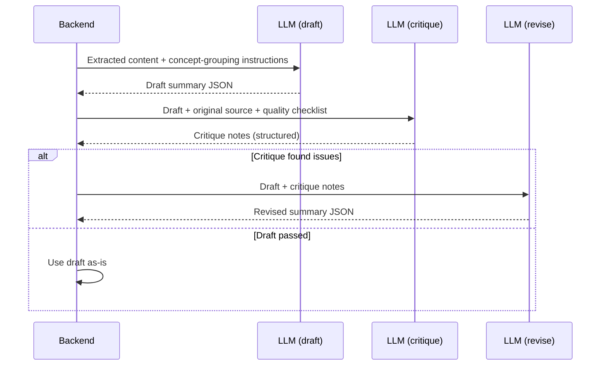
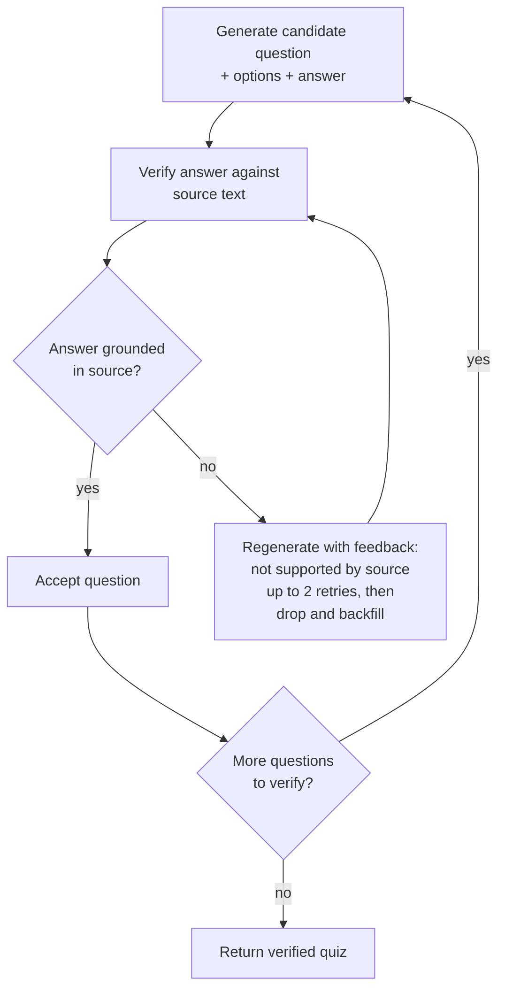
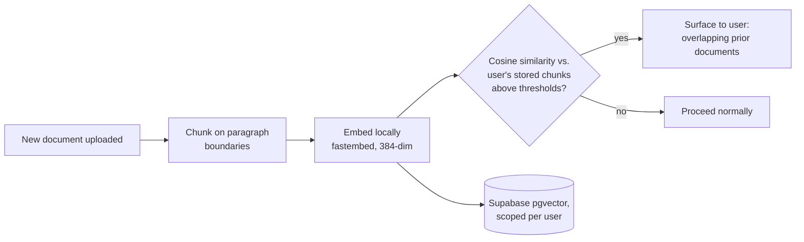
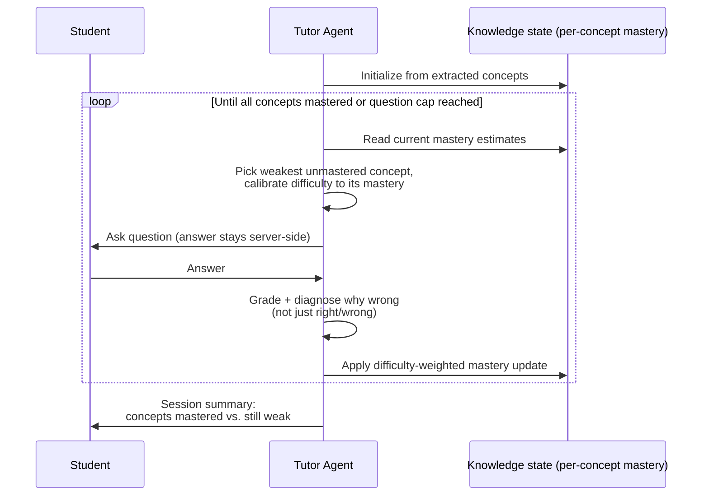

# Bloom

Bloom is an AI-powered study platform that turns uploaded course material into summaries, flashcards, practice quizzes, and adaptive one-on-one tutoring sessions. It is built around an agentic backend: every generation step is a multi-stage pipeline with self-verification rather than a single LLM call.

## Features

### Study tools

- Document upload with support for PDF, DOCX, and PPTX files
- Concept-grouped, bullet-point, short, and detailed summaries
- Interactive flashcards (definitions, concepts, facts, or mixed)
- Multiple-choice practice quizzes with per-question explanations
- Adaptive tutor sessions that select each next question live, based on a per-concept model of what the student understands
- Cross-upload memory that recognizes when new material overlaps documents the user has already studied

### Analytics and persistence

- User accounts via Supabase Auth; all data is scoped per user
- Persistent quiz history with per-question records
- Performance breakdowns by category, difficulty, and subject
- Score trends and profile statistics across all attempts

## Architecture

The backend is organized as a set of agents rather than one-shot prompt calls. Each stage fails open: any verification step that errors out degrades gracefully instead of blocking the user.



### Extraction agent

PDF pages are classified individually (title/agenda, dense text, diagram/chart, equation) before use. Text pages are kept as text; visual pages are rendered to images and described by a vision-capable model, so diagrams and equations contribute to generation instead of being silently dropped.



### Synthesis agent (draft, critique, revise)

Structured summaries go through a three-step loop: a draft is generated, a critique pass checks it against the source text and a fixed quality checklist (verbatim copying, redundant concepts, thin synthesis, schema violations), and a revision pass fixes any issues found before the result is returned.



### Quiz agent with grounding verification

Every generated question is fact-checked against the source text. Questions whose stated answers are not supported by the source are regenerated with feedback, and persistently ungrounded questions are dropped and backfilled, which suppresses hallucinated quiz content.



### Memory layer

Each upload is chunked on paragraph boundaries and embedded locally with fastembed (BAAI/bge-small-en-v1.5, 384 dimensions), then stored in Supabase pgvector scoped to the user. New uploads are compared against stored chunks via a cosine-similarity RPC; substantial overlap with prior documents is surfaced in the UI before the user generates duplicate study material. Embedding runs on the backend CPU, so this layer requires no external embedding API.



### Adaptive tutor

A tutor session extracts the key concepts from the material, initializes a per-concept mastery estimate, and then makes a fresh decision after every single answer: it targets the weakest unmastered concept, calibrates question difficulty to the current mastery estimate, grades the response server-side, and diagnoses why a wrong answer was likely chosen rather than just marking it incorrect. Sessions end early once every concept is mastered and close with a summary of mastered versus weak concepts.



## Tech stack

### Backend

- FastAPI with Uvicorn
- OpenRouter as the LLM provider (gpt-oss-120b on Cerebras for text; a separate vision-capable model for page descriptions)
- Supabase (PostgreSQL) for auth, persistence, and vector search via pgvector
- fastembed for local ONNX embeddings
- PyMuPDF, python-docx, and python-pptx for document parsing

### Frontend

- Next.js 16 (App Router, Turbopack) with TypeScript
- Tailwind CSS with a custom component library
- Supabase JS client for authentication

## Getting started

### Prerequisites

- Node.js 18 or higher
- Python 3.10 or higher
- A Supabase project
- An OpenRouter API key

### Backend setup

```bash
cd backend
python -m venv venv
source venv/bin/activate
pip install -r requirements.txt
```

Create `backend/.env`:

```env
OPENROUTER_API_KEY=your_openrouter_api_key
SUPABASE_URL=https://your-project.supabase.co
SUPABASE_SERVICE_ROLE_KEY=your_service_role_key
```

Apply the SQL in `backend/sql/` to your Supabase project (in the SQL editor), in order: `schema.sql`, then the `migrate_*.sql` files. `migrate_memory_layer.sql` enables the pgvector extension and creates the document memory tables.

Run the API:

```bash
python -m uvicorn app.main:app --reload --host 0.0.0.0 --port 8000
```

Note: the first upload after a fresh install downloads the local embedding model (approximately 100 MB) to the machine's cache.

### Frontend setup

```bash
cd frontend
npm install
```

Create `frontend/.env.local`:

```env
NEXT_PUBLIC_API_URL=http://localhost:8000
NEXT_PUBLIC_SUPABASE_URL=https://your-project.supabase.co
NEXT_PUBLIC_SUPABASE_ANON_KEY=your_anon_key
```

Run the development server:

```bash
npm run dev
```

The application is served at http://localhost:3000; interactive API documentation is available at http://localhost:8000/docs.

## API overview

All endpoints except `/` and `/health` require a Supabase Auth bearer token.

| Endpoint | Method | Description |
| --- | --- | --- |
| `/upload-pdf` | POST | Upload a PDF/DOCX/PPTX; returns extracted text and overlapping prior documents |
| `/generate-summary` | POST | Generate a summary (short, bullet points, or detailed) |
| `/generate-quiz` | POST | Generate a grounding-verified multiple-choice quiz |
| `/generate-flashcards` | POST | Generate a flashcard set |
| `/check-answers` | POST | Grade a quiz and persist the attempt |
| `/tutor/start` | POST | Start an adaptive tutor session; returns the first question |
| `/tutor/answer` | POST | Submit an answer; returns feedback, diagnosis, and the next question or session summary |
| `/subjects` | GET, POST | List or create the user's subjects |
| `/subjects/{id}` | DELETE | Delete a subject |
| `/me/stats` | GET | Aggregate profile statistics |
| `/me/analytics` | GET | Chart-ready performance datasets |
| `/me/recent-attempts` | GET | Recent quiz attempts |
| `/quiz-attempts/{id}/breakdown` | GET | Per-category and per-difficulty breakdown for an attempt |
| `/quiz-attempts/{id}/recap` | GET | Full question-by-question recap of an attempt |

## Project structure

```
bloom/
├── backend/
│   ├── app/
│   │   ├── main.py              # FastAPI routes
│   │   ├── models.py            # Pydantic request/response models
│   │   ├── ai_service.py        # LLM calls: synthesis, quiz grounding, tutor prompts
│   │   ├── extraction_agent.py  # Page-by-page PDF extraction with vision descriptions
│   │   ├── tutor_agent.py       # Adaptive tutor session state and orchestration
│   │   ├── memory_service.py    # Per-user vector memory over uploads
│   │   ├── db.py                # Supabase persistence layer
│   │   └── auth.py              # Supabase Auth token verification
│   ├── sql/                     # Database schema and migrations
│   └── requirements.txt
├── frontend/
│   ├── src/
│   │   ├── app/                 # Next.js App Router pages
│   │   ├── components/          # React components (study flow, tutor, analytics)
│   │   ├── lib/                 # API client and Supabase clients
│   │   └── types/               # Shared TypeScript types
│   └── package.json
├── ARCHITECTURE_CURRENT.md      # Architecture as originally built
├── ARCHITECTURE_FUTURE.md       # Agentic architecture design document
└── README.md
```

## License

This project is licensed under the MIT License. See the [LICENSE](LICENSE) file for details.
